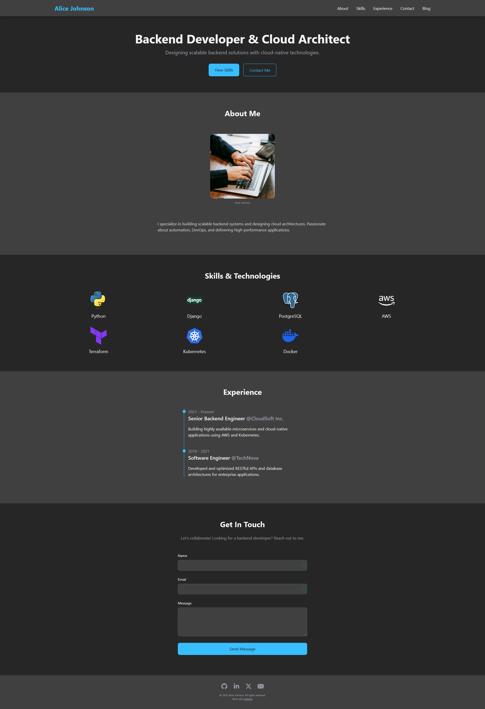
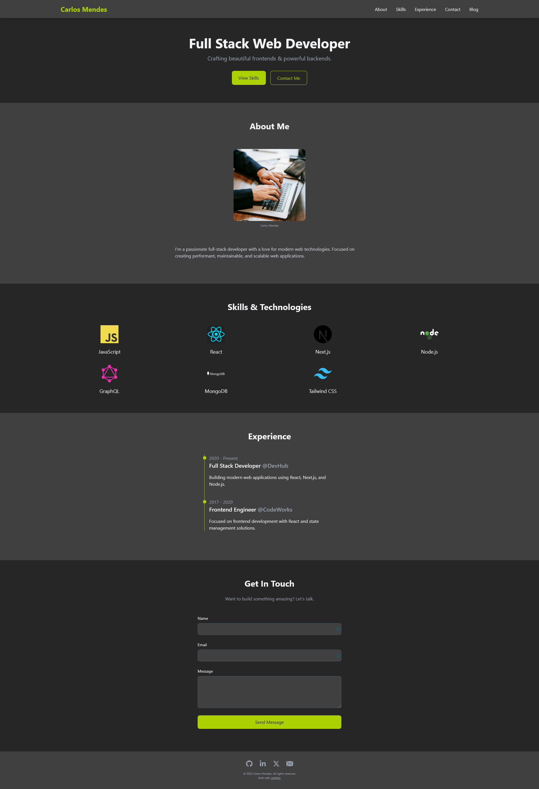

# Litefolio

Litefolio let's you host your own developer portfolio website based on a YAML file.

See [litefolio.yaml](./litefolio.yaml) for configuration reference.

See [portfolio.yaml](./portfolio.yaml) for portfolio reference.

> [!WARNING]
> Litefolio is not designed to directly face the internet. It does not support TLS for example.
> Run it behind a reverse-proxy like NGINX.

## Usage

There are Docker images available for x86 and ARM:

`docker run -p 8080:8080 -v portfolio.yaml:/litefolio/portfolio.yaml devmojo/litefolio:0.1.0-alpha`

## Examples

### Backend Developer
[backend-developer.yaml](./examples/portfolios/backend-developer.yaml)

### Full Stack Web Developer
[full-stack-web-developer.yaml](./examples/portfolios/full-stack-web-developer.yaml)

